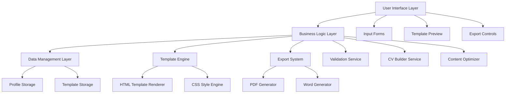

# Design Document: Data Scientist CV Generator

## Overview

The Data Scientist CV Generator is a web-based application that helps data scientists create professional, ATS-optimized CVs tailored specifically for data science roles. The system provides a structured input interface, multiple professional templates, and exports to both PDF and Word formats. The design emphasizes clean architecture, responsive design, and industry best practices for data science resume formatting.

## Architecture

The system follows a modular, component-based architecture with clear separation of concerns:



The architecture supports both client-side and server-side rendering, with the ability to run entirely in the browser for privacy-sensitive applications or on a server for enhanced processing capabilities.

## Components and Interfaces

### User Interface Layer

**Input Forms Component**
- Handles structured data entry for all CV sections
- Provides real-time validation and formatting hints
- Supports progressive disclosure for optional fields
- Implements responsive design for mobile and desktop

**Template Preview Component**
- Renders live preview of CV as user inputs data
- Supports template switching with instant preview updates
- Provides zoom and pagination controls for multi-page CVs
- Implements print-friendly preview mode

**Export Controls Component**
- Manages export format selection (PDF/Word)
- Provides download progress indicators
- Handles export customization options
- Supports batch export for multiple formats

### Business Logic Layer

**Validation Service**
- Email format validation using RFC 5322 standards
- Date validation and logical ordering checks
- URL validation for social profiles and project links
- Content length validation for optimal ATS parsing

**CV Builder Service**
- Orchestrates data flow between components
- Manages CV section ordering and prioritization
- Handles template application and customization
- Coordinates export generation process

**Content Optimizer**
- Suggests improvements for ATS optimization
- Provides keyword density analysis
- Recommends quantifiable metrics formatting
- Offers industry-specific content suggestions

### Data Management Layer

**Profile Storage**
- Manages user profile data persistence
- Supports local storage for privacy
- Handles data serialization and deserialization
- Implements data versioning for profile updates

**Template Storage**
- Manages template definitions and assets
- Supports template versioning and updates
- Handles template customization persistence
- Implements template validation and integrity checks

### Template Engine

**HTML Template Renderer**
- Processes template markup with user data
- Supports conditional content rendering
- Handles dynamic section ordering
- Implements responsive layout generation

**CSS Style Engine**
- Applies template-specific styling
- Supports theme customization
- Handles print-specific CSS optimizations
- Implements ATS-friendly formatting rules

### Export System

**PDF Generator**
- Utilizes Puppeteer for high-fidelity HTML-to-PDF conversion
- Supports custom page sizes and margins
- Handles multi-page layout optimization
- Implements print-ready formatting

**Word Generator**
- Converts HTML templates to Word-compatible format
- Maintains formatting compatibility across Word versions
- Supports ATS-friendly document structure
- Handles embedded styling and layout preservation

## Data Models

### Data Scientist Profile Model

```typescript
interface DataScientistProfile {
  personalInfo: PersonalInfo;
  professionalSummary: string;
  technicalSkills: SkillCategory[];
  workExperience: WorkExperience[];
  education: Education[];
  certifications: Certification[];
  projects: Project[];
  templateSettings: TemplateSettings;
}

interface PersonalInfo {
  fullName: string;
  email: string;
  phone: string;
  location: string;
  linkedinUrl?: string;
  githubUrl?: string;
  websiteUrl?: string;
}

interface SkillCategory {
  categoryName: string;
  skills: Skill[];
}

interface Skill {
  name: string;
  proficiencyLevel: 'Beginner' | 'Intermediate' | 'Advanced' | 'Expert';
}

interface WorkExperience {
  companyName: string;
  jobTitle: string;
  startDate: Date;
  endDate?: Date;
  location: string;
  responsibilities: string[];
  achievements: string[];
}

interface Education {
  institutionName: string;
  degreeType: string;
  fieldOfStudy: string;
  graduationDate: Date;
  gpa?: number;
  relevantCoursework?: string[];
}

interface Certification {
  name: string;
  issuingOrganization: string;
  issueDate: Date;
  expirationDate?: Date;
  credentialUrl?: string;
}

interface Project {
  name: string;
  description: string;
  technologiesUsed: string[];
  outcomes: string[];
  duration?: string;
  teamSize?: number;
  repositoryUrl?: string;
  demoUrl?: string;
}

interface TemplateSettings {
  templateId: string;
  colorScheme: string;
  fontFamily: string;
  customizations: Record<string, any>;
}
```

### Template Model

```typescript
interface CVTemplate {
  id: string;
  name: string;
  description: string;
  category: 'Modern' | 'Classic' | 'Technical' | 'Academic';
  htmlTemplate: string;
  cssStyles: string;
  customizationOptions: CustomizationOption[];
  atsOptimized: boolean;
  previewImage: string;
}

interface CustomizationOption {
  key: string;
  label: string;
  type: 'color' | 'font' | 'spacing' | 'boolean';
  defaultValue: any;
  options?: any[];
}
```

## Error Handling

The system implements comprehensive error handling across all layers:

**Input Validation Errors**
- Real-time field validation with user-friendly error messages
- Graceful handling of invalid date formats and ranges
- URL validation with specific feedback for different URL types
- Email format validation with suggestions for common mistakes

**Template Processing Errors**
- Fallback to default template if selected template fails to load
- Graceful degradation for missing template assets
- Error recovery for malformed template markup
- User notification with option to retry or select alternative template

**Export Generation Errors**
- Retry mechanism for failed PDF/Word generation
- Fallback export options if primary method fails
- Progress indication with ability to cancel long-running exports
- Detailed error reporting for troubleshooting

**Data Persistence Errors**
- Automatic backup of user data during input
- Recovery mechanisms for corrupted local storage
- Graceful handling of storage quota exceeded scenarios
- Data validation before persistence with rollback capabilities

## Testing Strategy

The testing strategy employs a dual approach combining unit tests for specific functionality and property-based tests for comprehensive validation:

**Unit Testing**
- Component-level tests for UI interactions and rendering
- Service-level tests for business logic validation
- Integration tests for data flow between components
- Export functionality tests with sample data verification
- Template rendering tests with various data combinations

**Property-Based Testing**
- Each property test runs a minimum of 100 iterations
- Tests are tagged with format: **Feature: data-scientist-cv-generator, Property {number}: {property_text}**
- Property tests focus on universal behaviors across all valid inputs
- Comprehensive input generation for robust validation coverage

**Testing Framework**
- Jest for unit testing with React Testing Library for component tests
- fast-check for property-based testing implementation
- Puppeteer for end-to-end export testing
- Custom generators for realistic data science profile data

**Test Data Generation**
- Realistic data generators for names, companies, skills, and projects
- Edge case generators for boundary conditions and error scenarios
- ATS-compliant content generators for validation testing
- Template compatibility generators for cross-template testing

## Correctness Properties

*A property is a characteristic or behavior that should hold true across all valid executions of a system—essentially, a formal statement about what the system should do. Properties serve as the bridge between human-readable specifications and machine-verifiable correctness guarantees.*

### Property 1: Data Persistence Round Trip
*For any* valid profile data (personal info, work experience, education, projects), storing the data and then retrieving it should produce equivalent data with all fields preserved
**Validates: Requirements 1.1, 4.1, 5.1, 6.1**

### Property 2: Email Validation Correctness
*For any* string input, the email validation should accept only strings that conform to RFC 5322 email format standards
**Validates: Requirements 1.2**

### Property 3: Content Placement Consistency
*For any* profile data, the generated CV should display personal information at the top, followed by professional summary, with all sections appearing in their designated locations
**Validates: Requirements 1.3, 2.3**

### Property 4: URL Validation and Storage
*For any* optional URL fields (LinkedIn, GitHub, website, project links), the system should accept valid URLs or empty values, and reject malformed URLs
**Validates: Requirements 1.4, 6.2**

### Property 5: Character Limit Validation
*For any* professional summary text, the system should provide appropriate feedback when the length is outside the 150-300 character optimal range
**Validates: Requirements 2.2**

### Property 6: Skill Categorization Integrity
*For any* set of skills with categories, the system should maintain the association between skills and their categories, including custom categories
**Validates: Requirements 3.1, 3.2**

### Property 7: Content Formatting Consistency
*For any* profile data, all sections (skills, experience, education, projects) should be formatted with consistent styling, proper bullet points, and clear hierarchical structure in the generated CV
**Validates: Requirements 3.3, 4.2, 5.3, 6.3**

### Property 8: Proficiency Level Preservation
*For any* skill with an assigned proficiency level, the system should store and display the proficiency level correctly in the generated CV
**Validates: Requirements 3.4**

### Property 9: Chronological Ordering
*For any* set of work experiences with dates, the system should display them in reverse chronological order (most recent first)
**Validates: Requirements 4.3**

### Property 10: Date Validation Logic
*For any* work experience or education entry, the system should reject invalid dates and ensure start dates occur before end dates when both are provided
**Validates: Requirements 4.5**

### Property 11: Project Ordering Control
*For any* set of projects with user-specified priority ordering, the system should display projects in the order specified by the user
**Validates: Requirements 6.5**

### Property 12: Export Format Generation
*For any* valid profile data, the system should successfully generate both PDF and Word format exports containing all the profile information
**Validates: Requirements 7.1, 7.2**

### Property 13: Cross-Format Consistency
*For any* profile data exported to both PDF and Word formats, the content and basic structure should be equivalent across both formats
**Validates: Requirements 7.3**

### Property 14: Multi-Page Layout Integrity
*For any* profile data that generates a multi-page CV, the system should include proper page breaks and maintain consistent margins throughout
**Validates: Requirements 7.5**

### Property 15: Template Application Consistency
*For any* selected template and profile data, the template styling should be applied consistently across all sections of the generated CV
**Validates: Requirements 8.3**

### Property 16: Template Customization Persistence
*For any* template customization options (colors, fonts), the applied customizations should persist and be reflected in the generated CV
**Validates: Requirements 8.4**

### Property 17: ATS Compatibility Maintenance
*For any* generated CV using any template, the output should maintain ATS-friendly formatting with proper text parsing structure
**Validates: Requirements 8.5**