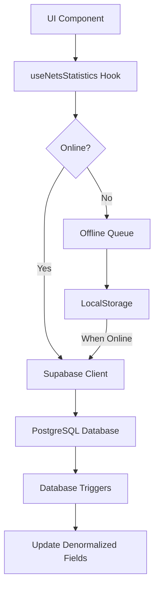
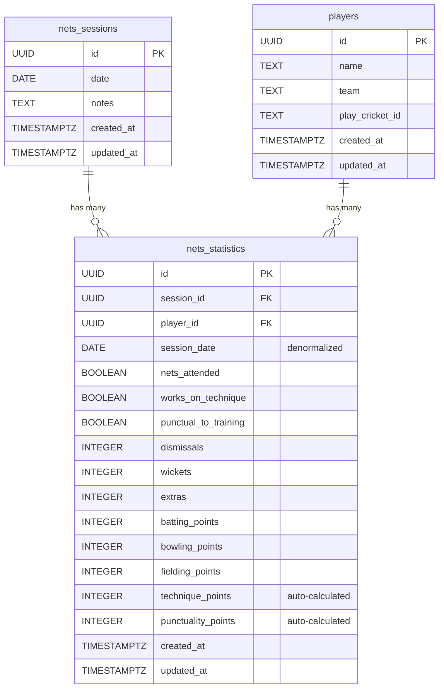

# Design Document: Database Enhancements

## Overview

This design enhances the cricket app database schema to improve query performance and add comprehensive player tracking capabilities. The enhancements include:

1. **Denormalization**: Adding `session_date` to `nets_statistics` to eliminate joins with `nets_sessions`
2. **Field Renaming**: Renaming `attended` to `nets_attended` for clarity
3. **Behavioral Tracking**: Adding boolean fields for technique work and punctuality
4. **Points System**: Adding numeric points columns for batting, bowling, fielding, technique, and punctuality
5. **Automatic Calculation**: Implementing logic to automatically calculate technique and punctuality points from boolean fields

The design maintains backward compatibility with existing data and functionality while providing a migration path for the schema changes.

## Architecture

### Database Layer

The database layer consists of:
- **PostgreSQL Database**: Supabase-hosted PostgreSQL database
- **Migration Scripts**: SQL scripts to modify the schema
- **Database Triggers**: Triggers to maintain data consistency between denormalized fields
- **Indexes**: Performance indexes on frequently queried columns

### Application Layer

The application layer consists of:
- **React Hooks**: Custom hooks for data fetching and mutations (`useNetsStatistics`)
- **Offline Queue**: Queue system for handling operations when offline
- **Conflict Resolution**: Last-write-wins strategy for handling concurrent updates
- **Type Definitions**: TypeScript/JavaScript type definitions for the enhanced schema

### Data Flow



## Components and Interfaces

### 1. Database Schema Changes

#### nets_statistics Table (Enhanced)

```sql
CREATE TABLE nets_statistics (
  id UUID PRIMARY KEY DEFAULT uuid_generate_v4(),
  session_id UUID NOT NULL REFERENCES nets_sessions(id) ON DELETE CASCADE,
  player_id UUID NOT NULL REFERENCES players(id) ON DELETE CASCADE,
  
  -- Renamed field
  nets_attended BOOLEAN DEFAULT FALSE,
  
  -- Denormalized field
  session_date DATE,
  
  -- Behavioral tracking
  works_on_technique BOOLEAN DEFAULT FALSE,
  punctual_to_training BOOLEAN DEFAULT FALSE,
  
  -- Performance metrics
  dismissals INTEGER DEFAULT 0,
  wickets INTEGER DEFAULT 0,
  extras INTEGER DEFAULT 0,
  
  -- Points columns
  batting_points INTEGER DEFAULT 0 CHECK (batting_points >= 0),
  bowling_points INTEGER DEFAULT 0 CHECK (bowling_points >= 0),
  fielding_points INTEGER DEFAULT 0 CHECK (fielding_points >= 0),
  technique_points INTEGER DEFAULT 0 CHECK (technique_points >= 0),
  punctuality_points INTEGER DEFAULT 0 CHECK (punctuality_points >= 0),
  
  created_at TIMESTAMPTZ DEFAULT NOW(),
  updated_at TIMESTAMPTZ DEFAULT NOW(),
  
  CONSTRAINT unique_session_player UNIQUE(session_id, player_id)
);
```

#### Indexes

```sql
-- Existing indexes
CREATE INDEX idx_nets_statistics_session_id ON nets_statistics(session_id);
CREATE INDEX idx_nets_statistics_player_id ON nets_statistics(player_id);

-- New index for session_date queries
CREATE INDEX idx_nets_statistics_session_date ON nets_statistics(session_date DESC);
```

### 2. Database Triggers

#### Trigger: Sync session_date on Insert

```sql
CREATE OR REPLACE FUNCTION sync_session_date_on_insert()
RETURNS TRIGGER AS $$
BEGIN
  -- Populate session_date from nets_sessions.date
  SELECT date INTO NEW.session_date
  FROM nets_sessions
  WHERE id = NEW.session_id;
  
  RETURN NEW;
END;
$$ LANGUAGE plpgsql;

CREATE TRIGGER trigger_sync_session_date_insert
  BEFORE INSERT ON nets_statistics
  FOR EACH ROW
  EXECUTE FUNCTION sync_session_date_on_insert();
```

#### Trigger: Sync session_date on nets_sessions Update

```sql
CREATE OR REPLACE FUNCTION sync_session_date_on_session_update()
RETURNS TRIGGER AS $$
BEGIN
  -- Update session_date in all related nets_statistics records
  IF NEW.date != OLD.date THEN
    UPDATE nets_statistics
    SET session_date = NEW.date,
        updated_at = NOW()
    WHERE session_id = NEW.id;
  END IF;
  
  RETURN NEW;
END;
$$ LANGUAGE plpgsql;

CREATE TRIGGER trigger_sync_session_date_update
  AFTER UPDATE ON nets_sessions
  FOR EACH ROW
  WHEN (OLD.date IS DISTINCT FROM NEW.date)
  EXECUTE FUNCTION sync_session_date_on_session_update();
```

#### Trigger: Auto-calculate Points

```sql
CREATE OR REPLACE FUNCTION calculate_behavioral_points()
RETURNS TRIGGER AS $$
BEGIN
  -- Calculate technique_points based on works_on_technique
  NEW.technique_points := CASE WHEN NEW.works_on_technique THEN 1 ELSE 0 END;
  
  -- Calculate punctuality_points based on punctual_to_training
  NEW.punctuality_points := CASE WHEN NEW.punctual_to_training THEN 1 ELSE 0 END;
  
  RETURN NEW;
END;
$$ LANGUAGE plpgsql;

CREATE TRIGGER trigger_calculate_behavioral_points
  BEFORE INSERT OR UPDATE ON nets_statistics
  FOR EACH ROW
  WHEN (
    NEW.works_on_technique IS DISTINCT FROM OLD.works_on_technique OR
    NEW.punctual_to_training IS DISTINCT FROM OLD.punctual_to_training OR
    OLD.id IS NULL
  )
  EXECUTE FUNCTION calculate_behavioral_points();
```

### 3. Migration Script

The migration script will:
1. Add new columns to `nets_statistics`
2. Rename `attended` to `nets_attended`
3. Backfill `session_date` from `nets_sessions`
4. Initialize all points columns to 0
5. Initialize behavioral fields to FALSE
6. Create indexes
7. Create triggers
8. Add column comments

```sql
-- Migration: 004_enhance_nets_statistics.sql

BEGIN;

-- Step 1: Add new columns
ALTER TABLE nets_statistics
  ADD COLUMN IF NOT EXISTS session_date DATE,
  ADD COLUMN IF NOT EXISTS works_on_technique BOOLEAN DEFAULT FALSE,
  ADD COLUMN IF NOT EXISTS punctual_to_training BOOLEAN DEFAULT FALSE,
  ADD COLUMN IF NOT EXISTS batting_points INTEGER DEFAULT 0 CHECK (batting_points >= 0),
  ADD COLUMN IF NOT EXISTS bowling_points INTEGER DEFAULT 0 CHECK (bowling_points >= 0),
  ADD COLUMN IF NOT EXISTS fielding_points INTEGER DEFAULT 0 CHECK (fielding_points >= 0),
  ADD COLUMN IF NOT EXISTS technique_points INTEGER DEFAULT 0 CHECK (technique_points >= 0),
  ADD COLUMN IF NOT EXISTS punctuality_points INTEGER DEFAULT 0 CHECK (punctuality_points >= 0);

-- Step 2: Backfill session_date from nets_sessions
UPDATE nets_statistics ns
SET session_date = s.date
FROM nets_sessions s
WHERE ns.session_id = s.id
  AND ns.session_date IS NULL;

-- Step 3: Rename attended to nets_attended
ALTER TABLE nets_statistics
  RENAME COLUMN attended TO nets_attended;

-- Step 4: Create index on session_date
CREATE INDEX IF NOT EXISTS idx_nets_statistics_session_date 
  ON nets_statistics(session_date DESC);

-- Step 5: Create triggers (functions and triggers defined above)
-- [Trigger creation SQL from section 2]

-- Step 6: Add column comments
COMMENT ON COLUMN nets_statistics.session_date IS 'Denormalized date from nets_sessions for query performance';
COMMENT ON COLUMN nets_statistics.nets_attended IS 'Whether the player attended the session';
COMMENT ON COLUMN nets_statistics.works_on_technique IS 'Whether player worked on technique during session';
COMMENT ON COLUMN nets_statistics.punctual_to_training IS 'Whether player arrived on time to session';
COMMENT ON COLUMN nets_statistics.batting_points IS 'Points awarded for batting performance';
COMMENT ON COLUMN nets_statistics.bowling_points IS 'Points awarded for bowling performance';
COMMENT ON COLUMN nets_statistics.fielding_points IS 'Points awarded for fielding performance';
COMMENT ON COLUMN nets_statistics.technique_points IS 'Points awarded for technique work (1 if works_on_technique, 0 otherwise)';
COMMENT ON COLUMN nets_statistics.punctuality_points IS 'Points awarded for punctuality (1 if punctual_to_training, 0 otherwise)';

COMMIT;
```

### 4. React Hook Updates

#### Enhanced useNetsStatistics Hook

The hook will be updated to:
- Use `nets_attended` instead of `attended`
- Include `session_date` in queries (no join needed)
- Include behavioral fields and points columns
- Handle automatic calculation of technique and punctuality points

```javascript
/**
 * Hook to fetch and manage nets statistics for a specific session
 * 
 * @param {string} sessionId - The session ID to fetch statistics for
 * @returns {Object} Hook state and methods
 */
export function useNetsStatistics(sessionId) {
  const [statistics, setStatistics] = useState([]);
  const [loading, setLoading] = useState(true);
  const [error, setError] = useState(null);

  const fetchStatistics = useCallback(async () => {
    if (!supabase || !sessionId) {
      setLoading(false);
      return;
    }

    try {
      setLoading(true);
      setError(null);

      const { data, error: fetchError } = await retrySupabaseQuery(async () => {
        return await supabase
          .from('nets_statistics')
          .select('*') // Now includes session_date, behavioral fields, and points
          .eq('session_id', sessionId);
      });

      if (fetchError) throw fetchError;
      setStatistics(data || []);
    } catch (err) {
      console.error('Error fetching nets statistics:', err);
      setError(new Error('Unable to load nets statistics. Please check your connection and try again.'));
      setStatistics([]);
    } finally {
      setLoading(false);
    }
  }, [sessionId]);

  /**
   * Update a player's nets statistic
   * Automatically calculates technique_points and punctuality_points
   */
  const updateStatistic = useCallback(async (playerId, stats) => {
    if (!supabase || !sessionId) {
      throw new Error('Supabase client or session ID not available');
    }

    // Calculate points from boolean fields if they're being updated
    const enhancedStats = { ...stats };
    if ('works_on_technique' in stats) {
      enhancedStats.technique_points = stats.works_on_technique ? 1 : 0;
    }
    if ('punctual_to_training' in stats) {
      enhancedStats.punctuality_points = stats.punctual_to_training ? 1 : 0;
    }

    const currentStat = statistics.find(s => s.player_id === playerId);
    
    // Optimistic update
    const optimisticStat = {
      ...currentStat,
      ...enhancedStats,
      session_id: sessionId,
      player_id: playerId,
      updated_at: new Date().toISOString()
    };

    setStatistics(prev => {
      const index = prev.findIndex(s => s.player_id === playerId);
      if (index >= 0) {
        const newStats = [...prev];
        newStats[index] = optimisticStat;
        return newStats;
      } else {
        return [...prev, optimisticStat];
      }
    });

    // If offline, queue the operation
    if (!isOnline()) {
      queueOperation({
        type: 'update_statistic',
        data: { sessionId, playerId, stats: enhancedStats },
        timestamp: Date.now()
      });
      return;
    }

    try {
      // Check if statistic exists
      const { data: existingStat } = await retrySupabaseQuery(async () => {
        return await supabase
          .from('nets_statistics')
          .select('id')
          .eq('session_id', sessionId)
          .eq('player_id', playerId)
          .single();
      });

      let result;
      if (existingStat) {
        // Update existing
        result = await retrySupabaseQuery(async () => {
          return await supabase
            .from('nets_statistics')
            .update({
              ...enhancedStats,
              updated_at: new Date().toISOString()
            })
            .eq('session_id', sessionId)
            .eq('player_id', playerId)
            .select()
            .single();
        });
      } else {
        // Insert new (trigger will populate session_date and calculate points)
        result = await retrySupabaseQuery(async () => {
          return await supabase
            .from('nets_statistics')
            .insert({
              session_id: sessionId,
              player_id: playerId,
              nets_attended: false,
              dismissals: 0,
              wickets: 0,
              extras: 0,
              batting_points: 0,
              bowling_points: 0,
              fielding_points: 0,
              works_on_technique: false,
              punctual_to_training: false,
              ...enhancedStats
            })
            .select()
            .single();
        });
      }

      if (result.error) throw result.error;

      // Apply last-write-wins
      if (shouldUpdate(currentStat, result.data)) {
        setStatistics(prev => {
          const index = prev.findIndex(s => s.player_id === playerId);
          if (index >= 0) {
            const newStats = [...prev];
            newStats[index] = result.data;
            return newStats;
          } else {
            return [...prev, result.data];
          }
        });
      }
    } catch (err) {
      console.error('Error updating nets statistic:', err);
      
      // Revert optimistic update
      if (currentStat) {
        setStatistics(prev => {
          const index = prev.findIndex(s => s.player_id === playerId);
          if (index >= 0) {
            const newStats = [...prev];
            newStats[index] = currentStat;
            return newStats;
          }
          return prev;
        });
      } else {
        setStatistics(prev => prev.filter(s => s.player_id !== playerId));
      }
      
      throw new Error('Unable to save nets statistic. Please check your connection and try again.');
    }
  }, [sessionId, statistics]);

  useEffect(() => {
    fetchStatistics();
  }, [fetchStatistics]);

  return {
    statistics,
    loading,
    error,
    updateStatistic,
    refetch: fetchStatistics
  };
}
```

### 5. Type Definitions

```typescript
interface NetsStatistic {
  id: string;
  session_id: string;
  player_id: string;
  session_date: string; // ISO date string
  nets_attended: boolean;
  works_on_technique: boolean;
  punctual_to_training: boolean;
  dismissals: number;
  wickets: number;
  extras: number;
  batting_points: number;
  bowling_points: number;
  fielding_points: number;
  technique_points: number; // Auto-calculated: 1 if works_on_technique, 0 otherwise
  punctuality_points: number; // Auto-calculated: 1 if punctual_to_training, 0 otherwise
  created_at: string;
  updated_at: string;
}
```

## Data Models

### Enhanced Nets Statistics Model

```javascript
const NetsStatisticModel = {
  // Primary keys
  id: 'UUID',
  session_id: 'UUID (FK to nets_sessions)',
  player_id: 'UUID (FK to players)',
  
  // Denormalized field
  session_date: 'DATE',
  
  // Attendance and behavior
  nets_attended: 'BOOLEAN',
  works_on_technique: 'BOOLEAN',
  punctual_to_training: 'BOOLEAN',
  
  // Performance metrics
  dismissals: 'INTEGER',
  wickets: 'INTEGER',
  extras: 'INTEGER',
  
  // Points (manually set by coach/system)
  batting_points: 'INTEGER',
  bowling_points: 'INTEGER',
  fielding_points: 'INTEGER',
  
  // Points (auto-calculated from booleans)
  technique_points: 'INTEGER', // Derived from works_on_technique
  punctuality_points: 'INTEGER', // Derived from punctual_to_training
  
  // Timestamps
  created_at: 'TIMESTAMPTZ',
  updated_at: 'TIMESTAMPTZ'
};
```

### Data Relationships




## Correctness Properties

*A property is a characteristic or behavior that should hold true across all valid executions of a system—essentially, a formal statement about what the system should do. Properties serve as the bridge between human-readable specifications and machine-verifiable correctness guarantees.*

### Property 1: Session Date Population on Insert

*For any* new nets_statistics record created with a valid session_id, the session_date field should be automatically populated with the date value from the corresponding nets_sessions record.

**Validates: Requirements 1.3**

### Property 2: Session Date Availability Without Join

*For any* nets_statistics record queried from the database, the session_date field should be present and populated without requiring a join to the nets_sessions table.

**Validates: Requirements 1.4, 5.4**

### Property 3: Session Date Synchronization

*For any* nets_sessions record whose date is updated, all related nets_statistics records should have their session_date values updated to match the new date.

**Validates: Requirements 1.5, 7.1**

### Property 4: Referential Integrity Enforcement

*For any* attempt to create a nets_statistics record with an invalid session_id (one that doesn't exist in nets_sessions), the system should reject the operation and return an error.

**Validates: Requirements 1.6, 6.3**

### Property 5: Boolean Field Default Values

*For any* nets_statistics record created without explicitly setting works_on_technique or punctual_to_training, both fields should default to FALSE.

**Validates: Requirements 2.3**

### Property 6: Boolean Field Type Validation

*For any* attempt to update works_on_technique or punctual_to_training with a non-boolean value, the system should reject the operation and return an error.

**Validates: Requirements 2.4**

### Property 7: Points Column Default Values

*For any* nets_statistics record created without explicitly setting points values, all points columns (batting_points, bowling_points, fielding_points, technique_points, punctuality_points) should default to 0.

**Validates: Requirements 3.7**

### Property 8: Technique Points Calculation

*For any* nets_statistics record, technique_points should equal 1 when works_on_technique is TRUE, and should equal 0 when works_on_technique is FALSE.

**Validates: Requirements 3.8, 3.9, 5.8, 5.9, 7.5**

### Property 9: Punctuality Points Calculation

*For any* nets_statistics record, punctuality_points should equal 1 when punctual_to_training is TRUE, and should equal 0 when punctual_to_training is FALSE.

**Validates: Requirements 3.10, 3.11, 5.10, 5.11, 7.6**

### Property 10: Migration Rollback on Failure

*For any* migration execution that encounters an error, all schema changes should be rolled back and the database should remain in its pre-migration state with all existing data preserved.

**Validates: Requirements 4.6**

### Property 11: Hook Includes Session Date

*For any* create or update operation performed by the useNetsStatistics hook, the operation should include the session_date field.

**Validates: Requirements 5.1**

### Property 12: Hook Includes All Points Columns

*For any* create or update operation performed by the useNetsStatistics hook, the operation should include all five points columns (batting_points, bowling_points, fielding_points, technique_points, punctuality_points).

**Validates: Requirements 5.2**

### Property 13: Hook Includes Behavioral Fields

*For any* create or update operation performed by the useNetsStatistics hook, the operation should include both behavioral fields (works_on_technique, punctual_to_training).

**Validates: Requirements 5.3**

### Property 14: Hook Uses Renamed Field

*For any* nets_statistics record fetched by the useNetsStatistics hook, the record should contain the nets_attended field (not attended).

**Validates: Requirements 5.5**

### Property 15: UI Data Completeness

*For any* nets_statistics record displayed in UI components, the record should contain session_date, works_on_technique, punctual_to_training, and all five points columns.

**Validates: Requirements 5.7**

### Property 16: Backward Compatibility for Existing Queries

*For any* existing query or operation that worked before the migration, the same query or operation should continue to work after the migration and return valid results.

**Validates: Requirements 6.1**

### Property 17: New Columns Have Valid Defaults

*For any* existing nets_statistics record accessed after migration, the new columns should be present with valid default values (FALSE for booleans, 0 for integers, populated date for session_date).

**Validates: Requirements 6.2**

### Property 18: Offline Queue Format Compatibility

*For any* operation in the offline queue (whether created before or after migration), the operation should be processed successfully when connectivity is restored.

**Validates: Requirements 6.4**

### Property 19: Conflict Resolution with Mixed Schemas

*For any* pair of nets_statistics records being compared during conflict resolution (one with new columns, one without), the last-write-wins strategy should correctly determine the winner based on updated_at timestamp.

**Validates: Requirements 6.5**

### Property 20: Field Name Backward Compatibility

*For any* code that references the old "attended" field name during a transition period, the system should correctly map it to "nets_attended" and return the expected value.

**Validates: Requirements 6.6**

### Property 21: Session Date Validation on Insert

*For any* new nets_statistics record being inserted, if session_date is explicitly provided, it should match the date value of the corresponding nets_sessions record, otherwise the insert should be rejected.

**Validates: Requirements 7.2**

### Property 22: Inconsistency Detection and Repair

*For any* nets_statistics record where session_date does not match the corresponding nets_sessions.date, a repair mechanism should detect the inconsistency and update session_date to match.

**Validates: Requirements 7.3**

## Error Handling

### Database Errors

1. **Foreign Key Violations**: When attempting to create a nets_statistics record with an invalid session_id or player_id, the database will reject the operation with a foreign key constraint error. The application should catch this and display a user-friendly message.

2. **Check Constraint Violations**: When attempting to set negative values for points columns, the database will reject the operation. The application should validate inputs before submission.

3. **Unique Constraint Violations**: When attempting to create duplicate records (same session_id and player_id), the database will reject the operation. The application should use upsert logic to handle this gracefully.

### Migration Errors

1. **Transaction Rollback**: The migration script wraps all changes in a transaction. If any step fails, all changes are rolled back automatically.

2. **Backfill Failures**: If backfilling session_date fails for any record (e.g., orphaned record with invalid session_id), the migration should log the error and continue, or fail the entire transaction depending on severity.

3. **Trigger Creation Failures**: If trigger creation fails, the migration should fail and rollback to prevent data inconsistency.

### Application Errors

1. **Offline Operations**: When offline, all write operations are queued. If the queue becomes too large (>1000 operations), warn the user and consider limiting new operations.

2. **Sync Failures**: When syncing the offline queue, if an operation fails, it should be retried up to 3 times before being marked as failed and requiring manual intervention.

3. **Conflict Resolution**: When conflicts occur, the last-write-wins strategy is applied. If timestamps are identical, prefer the remote version.

4. **Type Mismatches**: If the application receives data with unexpected types (e.g., string instead of boolean), it should attempt to coerce the value or reject it with a clear error message.

### Error Recovery

1. **Data Repair Script**: Provide a script to detect and repair inconsistencies between session_date and nets_sessions.date:

```sql
-- Repair script for session_date inconsistencies
UPDATE nets_statistics ns
SET session_date = s.date,
    updated_at = NOW()
FROM nets_sessions s
WHERE ns.session_id = s.id
  AND ns.session_date != s.date;
```

2. **Validation Query**: Provide a query to detect inconsistencies:

```sql
-- Find inconsistent records
SELECT ns.id, ns.session_id, ns.session_date, s.date as actual_date
FROM nets_statistics ns
JOIN nets_sessions s ON ns.session_id = s.id
WHERE ns.session_date != s.date;
```

## Testing Strategy

### Dual Testing Approach

This feature requires both unit tests and property-based tests to ensure comprehensive coverage:

- **Unit tests**: Verify specific examples, edge cases, and error conditions
- **Property tests**: Verify universal properties across all inputs

Both testing approaches are complementary and necessary. Unit tests catch concrete bugs in specific scenarios, while property tests verify general correctness across a wide range of inputs.

### Property-Based Testing

We will use **fast-check** (JavaScript property-based testing library) to implement property tests. Each property test will:

- Run a minimum of 100 iterations with randomized inputs
- Reference its corresponding design document property
- Use the tag format: **Feature: database-enhancements, Property {number}: {property_text}**

#### Example Property Test Structure

```javascript
import fc from 'fast-check';

// Feature: database-enhancements, Property 8: Technique Points Calculation
test('technique_points equals 1 when works_on_technique is TRUE, 0 when FALSE', () => {
  fc.assert(
    fc.property(
      fc.boolean(), // Generate random boolean for works_on_technique
      fc.record({   // Generate random statistic data
        session_id: fc.uuid(),
        player_id: fc.uuid(),
        dismissals: fc.nat(),
        wickets: fc.nat(),
        extras: fc.nat()
      }),
      async (worksOnTechnique, statData) => {
        // Create statistic with works_on_technique value
        const stat = await createStatistic({
          ...statData,
          works_on_technique: worksOnTechnique
        });
        
        // Verify technique_points matches expectation
        const expectedPoints = worksOnTechnique ? 1 : 0;
        expect(stat.technique_points).toBe(expectedPoints);
      }
    ),
    { numRuns: 100 }
  );
});
```

### Unit Testing

Unit tests will focus on:

1. **Specific Examples**: Test concrete scenarios like creating a statistic with specific values
2. **Edge Cases**: Test boundary conditions like maximum integer values, empty strings, null values
3. **Error Conditions**: Test that invalid inputs are properly rejected
4. **Integration Points**: Test interactions between hooks, offline queue, and conflict resolution

#### Example Unit Test Structure

```javascript
describe('useNetsStatistics', () => {
  test('creates new statistic with default values', async () => {
    const { result } = renderHook(() => useNetsStatistics('session-123'));
    
    await act(async () => {
      await result.current.updateStatistic('player-456', {
        nets_attended: true
      });
    });
    
    const stat = result.current.statistics.find(s => s.player_id === 'player-456');
    expect(stat.nets_attended).toBe(true);
    expect(stat.batting_points).toBe(0);
    expect(stat.bowling_points).toBe(0);
    expect(stat.fielding_points).toBe(0);
    expect(stat.technique_points).toBe(0);
    expect(stat.punctuality_points).toBe(0);
    expect(stat.works_on_technique).toBe(false);
    expect(stat.punctual_to_training).toBe(false);
  });
  
  test('automatically calculates technique_points when works_on_technique is set', async () => {
    const { result } = renderHook(() => useNetsStatistics('session-123'));
    
    await act(async () => {
      await result.current.updateStatistic('player-456', {
        works_on_technique: true
      });
    });
    
    const stat = result.current.statistics.find(s => s.player_id === 'player-456');
    expect(stat.works_on_technique).toBe(true);
    expect(stat.technique_points).toBe(1);
  });
});
```

### Migration Testing

Migration tests will verify:

1. **Schema Changes**: Verify all columns are added correctly
2. **Data Backfill**: Verify session_date is populated for existing records
3. **Trigger Functionality**: Verify triggers work correctly
4. **Rollback**: Verify failed migrations rollback completely

### Integration Testing

Integration tests will verify:

1. **End-to-End Flows**: Create session → create statistics → update statistics → verify data
2. **Offline Sync**: Queue operations offline → go online → verify sync
3. **Conflict Resolution**: Create conflicting updates → verify last-write-wins
4. **UI Integration**: Verify UI components can access and display all new fields

### Test Coverage Goals

- **Unit Test Coverage**: Aim for 90%+ code coverage
- **Property Test Coverage**: All 22 correctness properties must have corresponding property tests
- **Integration Test Coverage**: All major user flows must be tested end-to-end
- **Migration Test Coverage**: All migration steps must be tested, including rollback scenarios
