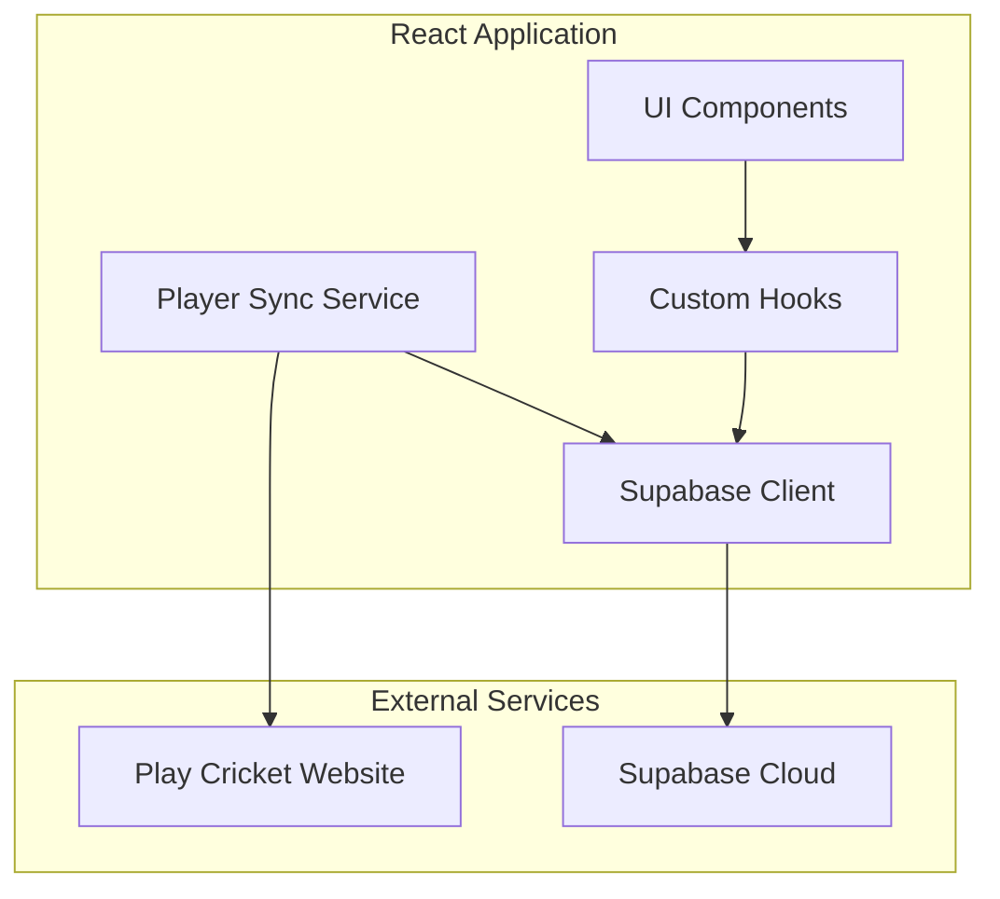

# Design Document: Supabase Player Sync

## Overview

This design document describes the integration of Supabase as the backend database for the MK Air Cricket Club training tracker application. The system will replace local state management with persistent cloud storage and implement automated player synchronization from the Play Cricket website.

The solution consists of three main components:
1. **Supabase Client Layer**: Manages database connections, queries, and real-time subscriptions
2. **Player Sync Service**: Scrapes player data from Play Cricket and synchronizes with the database
3. **Data Access Layer**: Provides React hooks and utilities for components to interact with Supabase

The design maintains all existing functionality while adding persistence, real-time updates, and automated player management.

## Architecture

### High-Level Architecture



### Component Interaction Flow

1. **Application Initialization**: React app initializes Supabase client with environment variables
2. **Data Loading**: Custom hooks fetch player data, ratings, and statistics from Supabase
3. **User Interactions**: UI updates trigger database writes through the data access layer
4. **Real-time Updates**: Supabase subscriptions push changes to all connected clients
5. **Player Sync**: Admin triggers sync service which scrapes Play Cricket and updates database

### Technology Stack

- **Frontend**: React 19.2.3 with Create React App
- **Database**: Supabase (PostgreSQL)
- **HTTP Client**: Fetch API for Play Cricket scraping
- **HTML Parsing**: DOMParser or cheerio-like library for extracting player data
- **State Management**: React hooks with Supabase real-time subscriptions
- **Authentication**: Supabase Auth (optional, with anonymous access fallback)

## Components and Interfaces

### 1. Supabase Client Configuration

**File**: `src/lib/supabase.js`

**Purpose**: Initialize and export the Supabase client instance

**Interface**:
```javascript
// Environment variables
REACT_APP_SUPABASE_URL: string
REACT_APP_SUPABASE_ANON_KEY: string

// Exported client
export const supabase: SupabaseClient

// Connection test function
export async function testConnection(): Promise<boolean>
```

**Implementation Notes**:
- Use `@supabase/supabase-js` library
- Load configuration from environment variables
- Provide connection testing utility for debugging
- Handle missing configuration gracefully

### 2. Database Schema

**Tables**:

**players**
```sql
CREATE TABLE players (
  id UUID PRIMARY KEY DEFAULT uuid_generate_v4(),
  play_cricket_id TEXT UNIQUE,
  name TEXT NOT NULL,
  team TEXT,
  created_at TIMESTAMPTZ DEFAULT NOW(),
  updated_at TIMESTAMPTZ DEFAULT NOW()
);
```

**skills_ratings**
```sql
CREATE TABLE skills_ratings (
  id UUID PRIMARY KEY DEFAULT uuid_generate_v4(),
  player_id UUID REFERENCES players(id) ON DELETE CASCADE,
  batting INTEGER CHECK (batting >= 0 AND batting <= 10),
  bowling INTEGER CHECK (bowling >= 0 AND bowling <= 10),
  fielding INTEGER CHECK (fielding >= 0 AND fielding <= 10),
  fitness INTEGER CHECK (fitness >= 0 AND fitness <= 10),
  created_at TIMESTAMPTZ DEFAULT NOW(),
  updated_at TIMESTAMPTZ DEFAULT NOW()
);

CREATE INDEX idx_skills_ratings_player_id ON skills_ratings(player_id);
```

**nets_sessions**
```sql
CREATE TABLE nets_sessions (
  id UUID PRIMARY KEY DEFAULT uuid_generate_v4(),
  date DATE NOT NULL,
  notes TEXT,
  created_at TIMESTAMPTZ DEFAULT NOW(),
  updated_at TIMESTAMPTZ DEFAULT NOW()
);

CREATE INDEX idx_nets_sessions_date ON nets_sessions(date DESC);
```

**nets_statistics**
```sql
CREATE TABLE nets_statistics (
  id UUID PRIMARY KEY DEFAULT uuid_generate_v4(),
  session_id UUID REFERENCES nets_sessions(id) ON DELETE CASCADE,
  player_id UUID REFERENCES players(id) ON DELETE CASCADE,
  attended BOOLEAN DEFAULT FALSE,
  dismissals INTEGER DEFAULT 0,
  wickets INTEGER DEFAULT 0,
  extras INTEGER DEFAULT 0,
  created_at TIMESTAMPTZ DEFAULT NOW(),
  updated_at TIMESTAMPTZ DEFAULT NOW(),
  UNIQUE(session_id, player_id)
);

CREATE INDEX idx_nets_statistics_session_id ON nets_statistics(session_id);
CREATE INDEX idx_nets_statistics_player_id ON nets_statistics(player_id);
```

**Row Level Security Policies**:
```sql
-- Allow anonymous read access
ALTER TABLE players ENABLE ROW LEVEL SECURITY;
CREATE POLICY "Allow anonymous read access" ON players FOR SELECT USING (true);

-- Similar policies for other tables
-- Write access controlled by authentication (if enabled)
```

### 3. Player Sync Service

**File**: `src/services/playerSyncService.js`

**Purpose**: Fetch player data from Play Cricket and synchronize with Supabase

**Interface**:
```javascript
export interface SyncResult {
  playersAdded: number;
  playersUpdated: number;
  playersUnchanged: number;
  errors: string[];
}

export async function syncPlayersFromPlayCricket(): Promise<SyncResult>
export async function fetchPlayCricketSquads(): Promise<PlayerData[]>
export async function upsertPlayers(players: PlayerData[]): Promise<SyncResult>
```

**Implementation Strategy**:

1. **Fetch Squad Data**:
   - Make HTTP GET request to https://mkair.play-cricket.com/Teams
   - Parse HTML response using DOMParser
   - Extract player names and team assignments from DOM structure
   - Handle pagination if multiple teams exist

2. **Parse Player Information**:
   - Identify player name elements (likely in table rows or list items)
   - Extract team/squad information from page structure
   - Create normalized player objects with name and team

3. **Upsert to Database**:
   - Query existing players from Supabase
   - Compare fetched players with existing records
   - Insert new players
   - Update team assignments for existing players
   - Track statistics for sync result

4. **Error Handling**:
   - Catch network errors and return descriptive messages
   - Handle HTML parsing failures gracefully
   - Validate player data before database operations
   - Use transactions for atomic updates

### 4. Data Access Layer (Custom Hooks)

**File**: `src/hooks/useSupabase.js`

**Purpose**: Provide React hooks for database operations

**Hooks**:

```javascript
// Fetch all players
export function usePlayers(): {
  players: Player[];
  loading: boolean;
  error: Error | null;
  refetch: () => Promise<void>;
}

// Fetch skills ratings for all players
export function useSkillsRatings(): {
  ratings: Map<string, SkillsRating>;
  loading: boolean;
  error: Error | null;
  updateRating: (playerId: string, ratings: Partial<SkillsRating>) => Promise<void>;
}

// Fetch nets sessions and statistics
export function useNetsSessions(): {
  sessions: NetsSession[];
  loading: boolean;
  error: Error | null;
  createSession: (date: Date) => Promise<string>;
}

export function useNetsStatistics(sessionId: string): {
  statistics: NetsStatistic[];
  loading: boolean;
  error: Error | null;
  updateStatistic: (playerId: string, stats: Partial<NetsStatistic>) => Promise<void>;
}

// Real-time subscription hook
export function useRealtimeSubscription(table: string, callback: (payload: any) => void): void
```

**Implementation Notes**:
- Use React's `useState` and `useEffect` for data fetching
- Implement optimistic updates for better UX
- Cache query results to minimize database calls
- Subscribe to real-time changes using Supabase subscriptions
- Implement retry logic with exponential backoff

### 5. Migration Utility

**File**: `src/utils/migration.js`

**Purpose**: Migrate hardcoded player data to Supabase

**Interface**:
```javascript
export interface MigrationResult {
  playersInserted: number;
  ratingsInserted: number;
  statisticsInserted: number;
  errors: string[];
}

export async function migrateHardcodedData(
  players: Player[],
  ratings: SkillsRating[],
  statistics: NetsStatistic[]
): Promise<MigrationResult>
```

**Implementation Strategy**:
1. Accept hardcoded data as function parameters
2. Batch insert players (handle duplicates with upsert)
3. Insert skills ratings linked to player IDs
4. Insert nets statistics linked to player and session IDs
5. Return detailed migration results

### 6. Admin UI Component

**File**: `src/components/AdminPanel.jsx`

**Purpose**: Provide UI for triggering player synchronization

**Interface**:
```javascript
export function AdminPanel(): JSX.Element
```

**Features**:
- "Sync Players" button
- Loading spinner during sync
- Success message with sync statistics
- Error message display
- Last sync timestamp display

## Data Models

### Player
```typescript
interface Player {
  id: string;              // UUID
  play_cricket_id?: string; // Optional ID from Play Cricket
  name: string;
  team?: string;           // Squad/team name
  created_at: Date;
  updated_at: Date;
}
```

### SkillsRating
```typescript
interface SkillsRating {
  id: string;
  player_id: string;
  batting: number;         // 0-10
  bowling: number;         // 0-10
  fielding: number;        // 0-10
  fitness: number;         // 0-10
  created_at: Date;
  updated_at: Date;
}
```

### NetsSession
```typescript
interface NetsSession {
  id: string;
  date: Date;
  notes?: string;
  created_at: Date;
  updated_at: Date;
}
```

### NetsStatistic
```typescript
interface NetsStatistic {
  id: string;
  session_id: string;
  player_id: string;
  attended: boolean;
  dismissals: number;
  wickets: number;
  extras: number;
  created_at: Date;
  updated_at: Date;
}
```


## Correctness Properties

*A property is a characteristic or behavior that should hold true across all valid executions of a system—essentially, a formal statement about what the system should do. Properties serve as the bridge between human-readable specifications and machine-verifiable correctness guarantees.*

### Property 1: Foreign Key Referential Integrity

*For any* attempt to insert or update a record with a foreign key reference, the operation should succeed if the referenced record exists, and fail with a constraint violation if the referenced record does not exist.

**Validates: Requirements 2.5**

### Property 2: HTML Parser Extracts Player Data

*For any* valid HTML response from the Play Cricket teams page, the parser should extract all player names and their associated team assignments without data loss.

**Validates: Requirements 3.2**

### Property 3: Player Upsert Correctness

*For any* player data from Play Cricket, if the player does not exist in the database, they should be inserted; if the player exists with different team information, their team should be updated; if the player exists with identical information, no changes should be made.

**Validates: Requirements 3.3, 3.4**

### Property 4: Sync Result Accuracy

*For any* player synchronization operation, the returned summary counts (players added, updated, unchanged) should exactly match the actual database operations performed.

**Validates: Requirements 3.5, 8.4**

### Property 5: Migration Data Preservation

*For any* set of hardcoded player data, ratings, and statistics, after migration completes, querying the database should return equivalent data for all migrated records.

**Validates: Requirements 4.2, 4.3, 4.4**

### Property 6: Duplicate Player Handling

*For any* migration operation, if a player with the same name already exists in the database, the migration should skip that player without modifying existing data or causing errors.

**Validates: Requirements 4.5**

### Property 7: Data Persistence Round Trip

*For any* valid skills rating or nets statistic update, after persisting to the database and re-fetching, the retrieved data should match the original update.

**Validates: Requirements 5.2, 5.3**

### Property 8: Last-Write-Wins Conflict Resolution

*For any* two concurrent writes to the same database record, the write with the later timestamp should be the final value stored in the database.

**Validates: Requirements 6.2**

### Property 9: Offline Queue Preservation

*For any* data modification made while offline, the change should be queued locally and successfully synchronized to the database when connectivity is restored.

**Validates: Requirements 6.3**

### Property 10: Retry with Exponential Backoff

*For any* failed Supabase query, the system should retry up to 3 times with exponentially increasing delays (e.g., 1s, 2s, 4s) before reporting final failure.

**Validates: Requirements 7.1**

### Property 11: Error Message Display

*For any* operation that fails after all retries, the system should display a user-friendly error message describing the failure.

**Validates: Requirements 7.2, 8.5**

### Property 12: Failed Write Input Preservation

*For any* database write operation that fails, the user's input data should remain in the UI form fields, allowing them to retry the operation without re-entering data.

**Validates: Requirements 7.5**

### Property 13: Export Data Completeness

*For any* database state, the Excel export should include all players, all their current skills ratings, and all nets statistics without omission.

**Validates: Requirements 10.3**

## Error Handling

### Network Errors

**Supabase Connection Failures**:
- Implement retry logic with exponential backoff (1s, 2s, 4s delays)
- After 3 failed attempts, display error message to user
- Cache last successful data fetch for offline access
- Display offline indicator in UI when connection is lost

**Play Cricket Website Unavailability**:
- Catch HTTP errors (404, 500, timeout) during sync
- Return descriptive error message in SyncResult
- Preserve existing player data in database
- Allow user to retry sync operation

### Data Validation Errors

**Invalid Player Data**:
- Validate player names are non-empty strings
- Validate team names match expected format
- Reject records with missing required fields
- Log validation errors for debugging

**Database Constraint Violations**:
- Catch foreign key constraint errors
- Catch unique constraint violations
- Display user-friendly error messages
- Provide guidance for resolving conflicts

### Parsing Errors

**HTML Structure Changes**:
- Wrap HTML parsing in try-catch blocks
- Return empty array if parsing fails
- Log parsing errors with HTML snippet for debugging
- Notify user that Play Cricket website structure may have changed

### Authentication Errors

**Unauthorized Access**:
- Catch Supabase auth errors (401, 403)
- Redirect to login page if authentication required
- Display "Permission denied" message for authorization failures
- Preserve user's intended action for post-login redirect

## Testing Strategy

### Dual Testing Approach

This feature requires both unit tests and property-based tests to ensure comprehensive coverage:

- **Unit tests**: Verify specific examples, edge cases, error conditions, and integration points
- **Property tests**: Verify universal properties across all inputs through randomization

Unit tests should focus on:
- Specific examples that demonstrate correct behavior (e.g., successful sync with known HTML)
- Integration points between components (e.g., Supabase client initialization)
- Edge cases and error conditions (e.g., empty player list, malformed HTML)

Property tests should focus on:
- Universal properties that hold for all inputs (e.g., data persistence round trip)
- Comprehensive input coverage through randomization (e.g., random player data)

### Property-Based Testing Configuration

**Library Selection**: Use `fast-check` for JavaScript/TypeScript property-based testing

**Test Configuration**:
- Minimum 100 iterations per property test
- Each property test must reference its design document property
- Tag format: `// Feature: supabase-player-sync, Property {number}: {property_text}`

**Example Property Test Structure**:
```javascript
import fc from 'fast-check';

// Feature: supabase-player-sync, Property 7: Data Persistence Round Trip
test('Property 7: Skills rating persistence round trip', async () => {
  await fc.assert(
    fc.asyncProperty(
      fc.record({
        playerId: fc.uuid(),
        batting: fc.integer({ min: 0, max: 10 }),
        bowling: fc.integer({ min: 0, max: 10 }),
        fielding: fc.integer({ min: 0, max: 10 }),
        fitness: fc.integer({ min: 0, max: 10 })
      }),
      async (rating) => {
        // Persist rating to database
        await updateSkillsRating(rating.playerId, rating);
        
        // Fetch rating from database
        const retrieved = await getSkillsRating(rating.playerId);
        
        // Verify round trip
        expect(retrieved.batting).toBe(rating.batting);
        expect(retrieved.bowling).toBe(rating.bowling);
        expect(retrieved.fielding).toBe(rating.fielding);
        expect(retrieved.fitness).toBe(rating.fitness);
      }
    ),
    { numRuns: 100 }
  );
});
```

### Unit Testing Strategy

**Component Testing**:
- Test Supabase client initialization with valid/invalid config
- Test custom hooks with mocked Supabase responses
- Test AdminPanel component interactions
- Test migration utility with sample data

**Integration Testing**:
- Test end-to-end player sync flow with mocked Play Cricket HTML
- Test database operations with test Supabase instance
- Test real-time subscription setup and teardown
- Test Excel export with database data

**Edge Case Testing**:
- Empty player lists
- Malformed HTML responses
- Network timeouts
- Concurrent data modifications
- Database constraint violations

### Test Data Management

**Test Database**:
- Use separate Supabase project for testing
- Reset database state before each test suite
- Use transactions for test isolation where possible

**Mock Data**:
- Create fixtures for Play Cricket HTML responses
- Generate realistic player data for testing
- Mock Supabase client for unit tests

### Continuous Integration

- Run all tests on every commit
- Require passing tests before merge
- Monitor test execution time
- Track test coverage metrics
