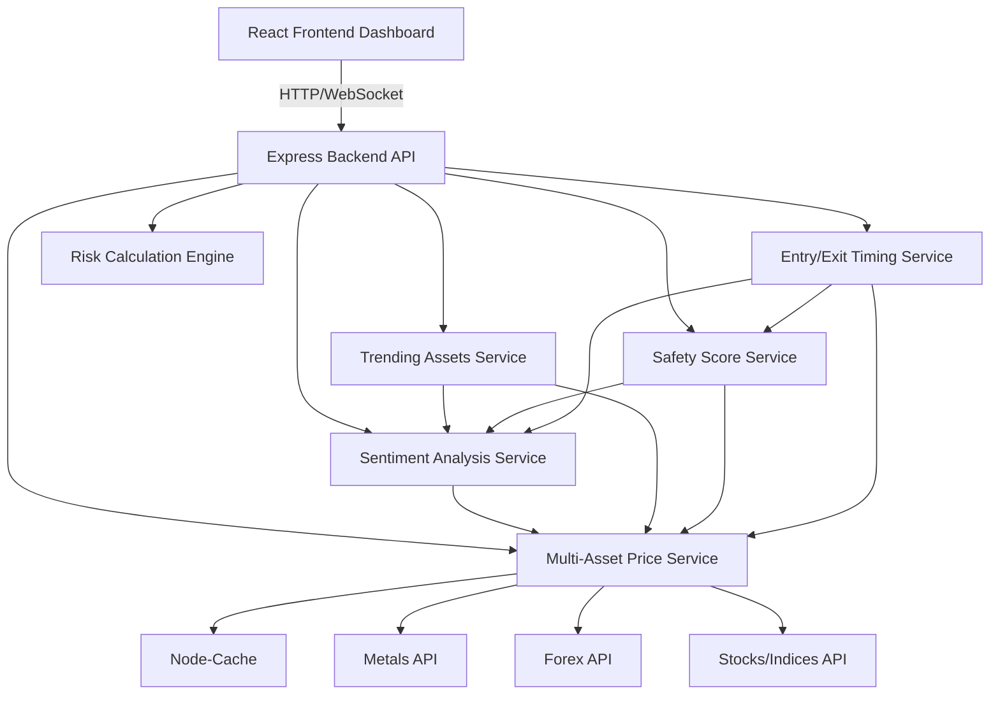

# Design Document: Multi-Asset Market Sentiment and Trading Risk Management

## Overview

This system provides traders with comprehensive market sentiment analysis across metals, forex, and stocks, combined with automated risk management calculations. The application identifies trending opportunities, assesses trade safety scores, suggests optimal entry and exit timing, and calculates lot sizes, stop loss, and take profit levels while enforcing a strict 3% maximum risk limit per trade.

The system integrates real-time pricing data from multiple asset classes, analyzes market trends and volatility, and presents actionable trading recommendations with safety assessments. The design emphasizes trader safety, opportunity discovery, and timing optimization through intelligent analysis and automated risk validation.

## Architecture

### High-Level Architecture



### Component Layers

1. **Presentation Layer** (React Frontend)
   - Trending assets dashboard with safety scores
   - Asset selector for metals, forex, and stocks
   - Entry/exit timing recommendations display
   - Trading parameters input forms
   - Real-time calculations and sentiment display
   - Filtering and sorting controls

2. **API Layer** (Express Backend)
   - RESTful endpoints for all services
   - WebSocket support for real-time updates
   - Request validation and error handling
   - Rate limiting and caching strategies

3. **Business Logic Layer**
   - Multi-Asset Price Service: Fetch prices from multiple sources
   - Sentiment Analysis Service: Calculate sentiment across asset classes
   - Trending Assets Service: Identify high-momentum opportunities
   - Safety Score Service: Assess trade safety based on multiple factors
   - Entry/Exit Timing Service: Suggest optimal trade timing
   - Risk Calculation Engine: Lot size, stop loss, take profit calculations

4. **Data Layer**
   - In-memory caching (node-cache) for price and analysis data
   - External API integrations for metals, forex, and stocks
   - Historical price data storage for trend analysis

## Components and Interfaces

### 1. Multi-Asset Price Service

**Responsibility**: Fetch and cache real-time prices from multiple asset class APIs

**Interface**:
```typescript
interface PriceDataService {
  getCurrentPrice(asset: Asset): Promise<AssetPrice>
  getPriceHistory(asset: Asset, period: TimePeriod): Promise<PricePoint[]>
  subscribeToUpdates(asset: Asset, callback: PriceUpdateCallback): void
  getLastUpdateTime(asset: Asset): Date
}

interface Asset {
  type: AssetType
  symbol: string
  name: string
}

type AssetType = 'METAL' | 'FOREX' | 'STOCK'

interface AssetPrice {
  asset: Asset
  price: number
  currency: string
  timestamp: Date
  bid: number
  ask: number
  spread: number
  volume?: number
}

interface PricePoint {
  timestamp: Date
  open: number
  high: number
  low: number
  close: number
  volume?: number
}

type TimePeriod = '1H' | '4H' | '1D' | '1W' | '1M'
```

**Supported Assets**:
- **Metals**: GOLD (XAU/USD), SILVER (XAG/USD), COPPER (HG), PLATINUM (XPT/USD), PALLADIUM (XPD/USD)
- **Forex**: EUR/USD, GBP/USD, USD/JPY, AUD/USD, USD/CHF, USD/CAD, NZD/USD
- **Stocks**: S&P 500 (SPX), NASDAQ (NDX), Dow Jones (DJI), FTSE 100 (FTSE), DAX (DAX), Nikkei 225 (N225)

### 2. Sentiment Analysis Service

**Responsibility**: Calculate market sentiment based on price movements and technical indicators

**Interface**:
```typescript
interface SentimentAnalysisService {
  getSentiment(asset: Asset): Promise<MarketSentiment>
  calculateSentimentScore(priceHistory: PricePoint[]): SentimentScore
  getBulkSentiment(assets: Asset[]): Promise<Map<string, MarketSentiment>>
}

interface MarketSentiment {
  asset: Asset
  sentiment: 'BULLISH' | 'BEARISH' | 'NEUTRAL'
  score: number // 0-100
  strength: 'WEAK' | 'MODERATE' | 'STRONG'
  indicators: SentimentIndicators
  timestamp: Date
}

interface SentimentIndicators {
  priceChange24h: number
  priceChange7d: number
  volatility: number
  momentum: number
  rsi: number // Relative Strength Index
  macdSignal: 'BULLISH' | 'BEARISH' | 'NEUTRAL'
}
```

### 3. Trending Assets Service

**Responsibility**: Identify and rank assets showing strong directional movement

**Interface**:
```typescript
interface TrendingAssetsService {
  getTrendingAssets(filters?: TrendingFilters): Promise<TrendingAsset[]>
  analyzeTrend(asset: Asset): Promise<TrendAnalysis>
}

interface TrendingFilters {
  assetTypes?: AssetType[]
  minMomentum?: number
  minSafetyScore?: number
  trendDirection?: 'UP' | 'DOWN' | 'BOTH'
}

interface TrendingAsset {
  asset: Asset
  priceChange24h: number
  priceChange7d: number
  momentum: number // 0-100
  trendCategory: 'STRONG_UPTREND' | 'MODERATE_UPTREND' | 'STRONG_DOWNTREND' | 'MODERATE_DOWNTREND'
  safetyScore: number
  sentiment: MarketSentiment
  currentPrice: number
  timestamp: Date
}

interface TrendAnalysis {
  direction: 'UP' | 'DOWN' | 'SIDEWAYS'
  strength: number // 0-100
  duration: string // e.g., "3 days"
  supportLevel: number
  resistanceLevel: number
  trendLine: { slope: number; intercept: number }
}
```

**Trend Calculation Logic**:
- **Momentum Score**: Combination of price velocity and acceleration
- **Trend Strength**: Based on ADX (Average Directional Index)
- **Categorization**:
  - Strong Uptrend: Momentum > 70, Price change > 3%
  - Moderate Uptrend: Momentum 50-70, Price change 1-3%
  - Strong Downtrend: Momentum > 70, Price change < -3%
  - Moderate Downtrend: Momentum 50-70, Price change -3% to -1%

### 4. Safety Score Service

**Responsibility**: Assess trade safety based on volatility, liquidity, and risk metrics

**Interface**:
```typescript
interface SafetyScoreService {
  calculateSafetyScore(asset: Asset): Promise<SafetyScore>
  getBulkSafetyScores(assets: Asset[]): Promise<Map<string, SafetyScore>>
}

interface SafetyScore {
  asset: Asset
  overallScore: number // 0-100
  category: 'VERY_SAFE' | 'SAFE' | 'MODERATE' | 'RISKY' | 'VERY_RISKY'
  components: SafetyComponents
  recommendation: string
  timestamp: Date
}

interface SafetyComponents {
  volatilityScore: number // 0-100 (lower volatility = higher score)
  liquidityScore: number // 0-100 (higher liquidity = higher score)
  spreadScore: number // 0-100 (tighter spread = higher score)
  trendStrengthScore: number // 0-100 (stronger trend = higher score)
  marketConditionsScore: number // 0-100 (favorable conditions = higher score)
}
```

**Safety Score Calculation**:
```
Overall Score = (
  Volatility Score × 0.30 +
  Liquidity Score × 0.25 +
  Spread Score × 0.20 +
  Trend Strength Score × 0.15 +
  Market Conditions Score × 0.10
)

Volatility Score = 100 - (ATR / Price × 10000)
Liquidity Score = min(100, Volume / Average Volume × 100)
Spread Score = 100 - (Spread / Price × 10000)
Trend Strength Score = ADX value (0-100)
Market Conditions Score = Based on VIX or equivalent volatility index
```

**Category Mapping**:
- Very Safe: 80-100
- Safe: 60-79
- Moderate: 40-59
- Risky: 20-39
- Very Risky: 0-19

### 5. Entry/Exit Timing Service

**Responsibility**: Suggest optimal entry and exit times based on technical analysis

**Interface**:
```typescript
interface TimingService {
  getEntryRecommendation(asset: Asset): Promise<EntryRecommendation>
  getExitRecommendation(asset: Asset, entryPrice: number, direction: 'LONG' | 'SHORT'): Promise<ExitRecommendation>
}

interface EntryRecommendation {
  asset: Asset
  recommendation: 'IMMEDIATE' | 'WAIT' | 'AVOID'
  confidence: number // 0-100
  reasoning: string[]
  technicalIndicators: TechnicalSignals
  suggestedEntryPrice?: number
  waitCondition?: string
  timeHorizon: 'SCALP' | 'DAY_TRADE' | 'SWING_TRADE' | 'POSITION_TRADE'
  timestamp: Date
}

interface ExitRecommendation {
  takeProfitLevels: ExitLevel[]
  stopLossLevel: ExitLevel
  trailingStopSuggestion?: number
  timeBasedExit?: string
}

interface ExitLevel {
  price: number
  reasoning: string
  technicalBasis: string // e.g., "Resistance at 2050", "Fibonacci 1.618"
  probability: number // 0-100
}

interface TechnicalSignals {
  trendAlignment: boolean
  supportResistance: { support: number; resistance: number }
  momentum: 'STRONG' | 'MODERATE' | 'WEAK'
  volumeConfirmation: boolean
  rsi: number
  macd: { value: number; signal: number; histogram: number }
  movingAverages: { ma20: number; ma50: number; ma200: number }
}
```

**Entry Timing Logic**:
- **IMMEDIATE**: Strong trend + momentum + volume confirmation + favorable risk-reward
- **WAIT**: Trend present but waiting for pullback to support/resistance
- **AVOID**: Weak trend, high volatility, poor risk-reward, or conflicting signals

**Exit Timing Logic**:
- **Take Profit**: Based on Fibonacci extensions, resistance levels, and risk-reward ratios
- **Stop Loss**: Based on support levels, ATR, and 3% risk limit
- **Time Horizon**: Based on trend strength and volatility

### 6. Risk Calculation Engine

**Responsibility**: Calculate lot sizes, stop loss, and take profit levels based on risk parameters

**Interface**:
```typescript
interface RiskCalculationEngine {
  calculateLotSize(params: LotSizeParams): LotSizeResult
  calculateStopLoss(params: StopLossParams): StopLossResult
  calculateTakeProfit(params: TakeProfitParams): TakeProfitResult
  validateRisk(params: TradeParams): RiskValidation
}

interface LotSizeParams {
  tradingCapital: number
  entryPrice: number
  stopLossDistance: number
  asset: Asset
  riskPercentage: number // default 3%
}

interface LotSizeResult {
  lotSize: number
  units: number
  maxLoss: number
  riskPercentage: number
  valid: boolean
  warnings: string[]
}

interface StopLossParams {
  entryPrice: number
  tradingCapital: number
  lotSize: number
  asset: Asset
  direction: 'LONG' | 'SHORT'
  riskPercentage: number // default 3%
  technicalStopLoss?: number // from timing service
}

interface StopLossResult {
  stopLossPrice: number
  distanceInPips: number
  distanceInCurrency: number
  maxLoss: number
  valid: boolean
  technicalAlignment: boolean
}

interface TakeProfitParams {
  entryPrice: number
  stopLossPrice: number
  riskRewardRatio: number
  direction: 'LONG' | 'SHORT'
  technicalTargets?: number[] // from timing service
}

interface TakeProfitResult {
  takeProfitPrice: number
  distanceInPips: number
  potentialProfit: number
  riskRewardRatio: number
  technicalAlignment: boolean
}
```

### 7. Asset Configuration Service

**Responsibility**: Provide asset-specific trading parameters

**Interface**:
```typescript
interface AssetConfigService {
  getConfig(asset: Asset): AssetConfig
}

interface AssetConfig {
  asset: Asset
  symbol: string
  contractSize: number
  pipSize: number
  pipValue: number
  minLotSize: number
  maxLotSize: number
  lotStepSize: number
  displayDecimals: number
  tradingHours: TradingHours
  marginRequirement: number
}

interface TradingHours {
  open: string // e.g., "09:30"
  close: string // e.g., "16:00"
  timezone: string
  tradingDays: string[] // e.g., ["MON", "TUE", "WED", "THU", "FRI"]
}
```

**Asset Configurations**:

**Metals**:
- Gold (XAU/USD): Contract = 100 oz, Pip = 0.01, Pip value = $1
- Silver (XAG/USD): Contract = 5000 oz, Pip = 0.001, Pip value = $5
- Copper (HG): Contract = 25000 lbs, Pip = 0.0001, Pip value = $2.50
- Platinum (XPT/USD): Contract = 50 oz, Pip = 0.01, Pip value = $0.50
- Palladium (XPD/USD): Contract = 100 oz, Pip = 0.01, Pip value = $1

**Forex**:
- EUR/USD: Contract = 100,000 units, Pip = 0.0001, Pip value = $10
- GBP/USD: Contract = 100,000 units, Pip = 0.0001, Pip value = $10
- USD/JPY: Contract = 100,000 units, Pip = 0.01, Pip value = $9.09 (approx)
- AUD/USD: Contract = 100,000 units, Pip = 0.0001, Pip value = $10
- USD/CHF: Contract = 100,000 units, Pip = 0.0001, Pip value = $10
- USD/CAD: Contract = 100,000 units, Pip = 0.0001, Pip value = $10
- NZD/USD: Contract = 100,000 units, Pip = 0.0001, Pip value = $10

**Stocks/Indices**:
- S&P 500: Contract = $50 per point, Pip = 0.25, Pip value = $12.50
- NASDAQ: Contract = $20 per point, Pip = 0.25, Pip value = $5
- Dow Jones: Contract = $10 per point, Pip = 1.0, Pip value = $10

### 8. Frontend Components

**Main Components**:

1. **TrendingDashboard**: Grid display of trending assets with safety scores
2. **AssetSelector**: Dropdown/tabs for selecting asset type and specific asset
3. **SentimentDisplay**: Visual sentiment indicator with score and strength
4. **SafetyScoreCard**: Color-coded safety score with component breakdown
5. **EntryTimingPanel**: Entry recommendation with reasoning and technical signals
6. **ExitTimingPanel**: Suggested take profit and stop loss levels
7. **TradingParametersForm**: Input fields for capital, entry price, lot size
8. **RiskCalculationDisplay**: Calculated lot size, stop loss, take profit
9. **RiskWarningBanner**: Warnings when risk exceeds limits
10. **LivePriceDisplay**: Real-time price updates with timestamp
11. **FilterControls**: Filter trending assets by type, safety, momentum

## Data Models

### Trade Parameters Model
```typescript
interface TradeParameters {
  asset: Asset
  tradingCapital: number
  entryPrice: number
  stopLossDistance?: number
  stopLossPrice?: number
  direction: 'LONG' | 'SHORT'
  riskPercentage: number // fixed at 3%
  customRiskRewardRatio?: number
  useTimingRecommendations: boolean
}
```

### Calculation Result Model
```typescript
interface CalculationResult {
  lotSize: number
  stopLossPrice: number
  takeProfitLevels: TakeProfitLevel[]
  maxLoss: number
  riskPercentage: number
  safetyScore: SafetyScore
  entryRecommendation: EntryRecommendation
  exitRecommendation: ExitRecommendation
  valid: boolean
  errors: ValidationError[]
  warnings: string[]
}

interface TakeProfitLevel {
  ratio: number
  price: number
  potentialProfit: number
  distanceInPips: number
  technicalAlignment: boolean
}
```

## API Endpoints

**Base URL**: `/api/v1`

### Price Endpoints
1. **GET /assets/:assetType/:symbol/price** - Current price for asset
2. **GET /assets/:assetType/:symbol/history** - Price history
3. **WebSocket /ws/prices** - Real-time price updates

### Sentiment Endpoints
4. **GET /assets/:assetType/:symbol/sentiment** - Market sentiment
5. **GET /sentiment/bulk** - Bulk sentiment for multiple assets

### Trending Endpoints
6. **GET /trending** - List of trending assets with filters
7. **GET /trending/:assetType** - Trending assets by type

### Safety Endpoints
8. **GET /assets/:assetType/:symbol/safety** - Safety score
9. **GET /safety/bulk** - Bulk safety scores

### Timing Endpoints
10. **GET /assets/:assetType/:symbol/entry** - Entry recommendation
11. **GET /assets/:assetType/:symbol/exit** - Exit recommendation

### Calculation Endpoints
12. **POST /calculate/lot-size** - Calculate lot size
13. **POST /calculate/stop-loss** - Calculate stop loss
14. **POST /calculate/take-profit** - Calculate take profit
15. **POST /calculate/full** - Full calculation with timing

### Configuration Endpoints
16. **GET /assets/:assetType/:symbol/config** - Asset configuration
17. **GET /assets/supported** - List all supported assets


## Correctness Properties

*A property is a characteristic or behavior that should hold true across all valid executions of a system—essentially, a formal statement about what the system should do. Properties serve as the bridge between human-readable specifications and machine-verifiable correctness guarantees.*

### Property 1: Multi-Asset Sentiment Retrieval
*For any* supported asset (metal, forex pair, or stock index), when a user selects that asset, the system should successfully retrieve and display sentiment data with a valid indicator (bullish, bearish, or neutral) and a score between 0 and 100.

**Validates: Requirements 1.1, 1.2, 1.3**

### Property 2: 3% Risk Limit Invariant
*For any* combination of trading capital, entry price, stop loss distance, lot size, and asset type, the calculated maximum loss should never exceed 3% of the trading capital. This invariant must hold regardless of which parameter is modified or in what order.

**Validates: Requirements 2.2, 3.1, 3.2, 5.1, 5.2**

### Property 3: Lot Size Calculation Correctness
*For any* valid trading capital, entry price, stop loss distance, and asset, the calculated lot size should be such that: (Lot Size × Stop Loss Distance × Pip Value) ≤ (Trading Capital × 0.03).

**Validates: Requirements 2.1**

### Property 4: Input Validation Rejection
*For any* invalid input (zero, negative, or non-numeric values) for trading capital, entry price, or stop loss distance, the system should reject the input, prevent calculation, and display a validation error.

**Validates: Requirements 2.4**

### Property 5: Asset-Specific Configuration Application
*For any* selected asset (metal, forex, or stock), the system should apply the correct asset-specific configuration including pip/point value, lot size units, contract size, and display decimals in all calculations and displays.

**Validates: Requirements 6.2, 6.3, 6.4, 6.5, 6.6**

### Property 6: Take Profit Ratio Correctness
*For any* entry price, stop loss price, risk-reward ratio R, and direction, the calculated take profit price should satisfy: |Take Profit - Entry| = R × |Entry - Stop Loss|.

**Validates: Requirements 4.1, 4.3**

### Property 7: Sentiment Direction Alignment
*For any* bearish market sentiment, suggested stop loss levels should be positioned above the entry price (appropriate for short positions), and for bullish sentiment, below the entry price (appropriate for long positions).

**Validates: Requirements 3.5**

### Property 8: Trending Assets Categorization
*For any* asset analyzed for trending, the trend category (Strong Uptrend, Moderate Uptrend, Strong Downtrend, Moderate Downtrend) should correctly correspond to its momentum score and price change percentage according to the defined thresholds.

**Validates: Requirements 7.4**

### Property 9: Trending Assets Sorting
*For any* list of trending assets, they should be sorted in descending order by momentum score (highest momentum first).

**Validates: Requirements 7.5**

### Property 10: Safety Score Monotonicity
*For any* two assets A and B, if A has lower volatility, higher liquidity, tighter spread, and stronger trend than B, then A's safety score should be higher than B's safety score.

**Validates: Requirements 8.2, 8.3, 8.4, 8.5**

### Property 11: Safety Score Categorization
*For any* calculated safety score S, the assigned category should match the score range: Very Safe (80-100), Safe (60-79), Moderate (40-59), Risky (20-39), or Very Risky (0-19).

**Validates: Requirements 8.6**

### Property 12: Safety Score Filtering
*For any* minimum safety score threshold T, the filtered trending assets list should contain only assets with safety scores ≥ T.

**Validates: Requirements 8.8**

### Property 13: Entry Recommendation Completeness
*For any* entry recommendation, it must include one of three valid recommendations (Immediate, Wait, Avoid), and must include appropriate supporting data: technical indicators for Immediate, wait condition for Wait, or reason for Avoid.

**Validates: Requirements 9.1, 9.2, 9.3, 9.4**

### Property 14: Exit Recommendation Technical Alignment
*For any* trade plan, the suggested take profit levels should be at or near technical resistance levels (for longs) or support levels (for shorts), and stop loss levels should be at or near technical support levels (for longs) or resistance levels (for shorts).

**Validates: Requirements 9.5, 9.6**

### Property 15: Display Completeness
*For any* calculated result, the system should display all required information including: lot size with asset-specific precision, stop loss as both price and distance, take profit as both price and distance, maximum loss in both currency and percentage, current market price with timestamp, safety score, and entry/exit recommendations.

**Validates: Requirements 2.5, 3.4, 4.2, 5.3, 5.4, 7.2, 7.3, 8.1, 8.7, 9.7, 11.4**

### Property 16: Reactive Recalculation
*For any* change to trading capital, entry price, stop loss distance, or asset selection, the system should automatically recalculate all dependent values (lot size, stop loss price, take profit levels, max loss, safety score, entry/exit recommendations) and update the display without requiring manual refresh.

**Validates: Requirements 5.5, 10.2**

### Property 17: Price Update Propagation
*For any* market price update received from the data provider, the system should update the displayed price without requiring a page refresh and include the update timestamp.

**Validates: Requirements 11.2**

### Property 18: Data Freshness Indication
*For any* displayed price data, if the data is cached or delayed (older than 60 seconds), the system should clearly indicate the data age to the user.

**Validates: Requirements 11.5**

### Property 19: Trending Asset Selection Propagation
*For any* trending asset selected by the user, the system should automatically populate the trading parameters form with that asset's current price and configuration.

**Validates: Requirements 7.7**

### Property 20: Filter Application Correctness
*For any* combination of filters applied to trending assets (asset type, minimum safety score, minimum momentum, trend direction), the returned list should contain only assets that satisfy all filter criteria.

**Validates: Requirements 10.7**

## Error Handling

### Error Categories

1. **Validation Errors**
   - Invalid input values (negative, zero, non-numeric)
   - Risk limit exceeded
   - Invalid stop loss placement
   - Response: Display field-specific error messages, prevent calculation

2. **Data Availability Errors**
   - External API unavailable
   - Asset price data not found
   - Sentiment data unavailable
   - Historical data insufficient for analysis
   - Response: Display error banner, use cached data if available, show last update time

3. **Calculation Errors**
   - Division by zero
   - Overflow/underflow
   - Invalid mathematical operations
   - Insufficient data for technical analysis
   - Response: Display generic error message, log details, maintain previous valid state

4. **Network Errors**
   - Connection timeout
   - WebSocket disconnection
   - API rate limiting
   - Multiple API failures
   - Response: Implement exponential backoff, display connection status, queue requests, fallback to polling

### Error Recovery Strategies

1. **Graceful Degradation**
   - Use cached price data when real-time data unavailable
   - Allow manual price input if API fails
   - Maintain last valid calculation state
   - Show trending assets from cache if live data unavailable
   - Disable timing recommendations if insufficient data

2. **Retry Logic**
   - Exponential backoff for API requests: 1s, 2s, 4s, 8s, max 30s
   - Maximum 5 retry attempts before displaying error
   - Automatic reconnection for WebSocket with backoff
   - Separate retry queues for different API providers

3. **User Feedback**
   - Real-time validation feedback as user types
   - Clear error messages with suggested corrections
   - Connection status indicator per data source (metals, forex, stocks)
   - Data freshness indicator (live, cached, stale)
   - Warning when recommendations based on incomplete data

4. **Fallback Mechanisms**
   - WebSocket → Polling fallback for price updates
   - Primary API → Secondary API fallback for price data
   - Real-time analysis → Cached analysis fallback
   - Technical indicators → Simple momentum fallback

### Error Handling Implementation

```typescript
class ErrorHandler {
  handleValidationError(error: ValidationError): void {
    // Display error next to relevant field
    // Prevent calculation
    // Maintain current state
  }
  
  handleAPIError(error: APIError, source: 'METALS' | 'FOREX' | 'STOCKS'): void {
    // Log error details with source
    // Attempt retry with backoff
    // Try fallback API if available
    // Fall back to cached data
    // Display user-friendly message with source indicator
  }
  
  handleCalculationError(error: CalculationError): void {
    // Log error with context
    // Display generic error message
    // Maintain previous valid state
    // Suggest parameter adjustments
  }
  
  handleInsufficientDataError(error: InsufficientDataError): void {
    // Disable affected features (e.g., timing recommendations)
    // Display warning about limited functionality
    // Suggest waiting for more data
    // Use simplified calculations where possible
  }
}
```

## Testing Strategy

### Dual Testing Approach

This system requires both unit testing and property-based testing to ensure comprehensive correctness:

- **Unit tests**: Verify specific examples, edge cases, and error conditions
- **Property tests**: Verify universal properties across all inputs

Both testing approaches are complementary and necessary. Unit tests catch concrete bugs with specific inputs, while property tests verify general correctness across the entire input space.

### Property-Based Testing

**Framework**: We will use **fast-check** for JavaScript/TypeScript property-based testing.

**Configuration**:
- Minimum 100 iterations per property test
- Each test must reference its design document property
- Tag format: `// Feature: metals-sentiment-trading, Property {number}: {property_text}`

**Property Test Examples**:

1. **Property 2: 3% Risk Limit Invariant**
   ```typescript
   // Feature: metals-sentiment-trading, Property 2: 3% Risk Limit Invariant
   fc.assert(
     fc.property(
       fc.float({ min: 1000, max: 1000000 }), // trading capital
       fc.float({ min: 1, max: 10000 }), // entry price
       fc.float({ min: 1, max: 1000 }), // stop loss distance
       fc.constantFrom('GOLD', 'EUR/USD', 'SPX'), // asset
       (capital, entry, slDistance, assetSymbol) => {
         const asset = createAsset(assetSymbol);
         const result = calculateLotSize({ capital, entry, slDistance, asset });
         const maxLoss = result.lotSize * slDistance * getPipValue(asset);
         return maxLoss <= capital * 0.03;
       }
     ),
     { numRuns: 100 }
   );
   ```

2. **Property 9: Trending Assets Sorting**
   ```typescript
   // Feature: metals-sentiment-trading, Property 9: Trending Assets Sorting
   fc.assert(
     fc.property(
       fc.array(fc.record({
         asset: fc.constantFrom('GOLD', 'EUR/USD', 'SPX'),
         momentum: fc.float({ min: 0, max: 100 })
       }), { minLength: 2, maxLength: 20 }),
       (trendingData) => {
         const sorted = sortTrendingAssets(trendingData);
         for (let i = 0; i < sorted.length - 1; i++) {
           if (sorted[i].momentum < sorted[i + 1].momentum) {
             return false;
           }
         }
         return true;
       }
     ),
     { numRuns: 100 }
   );
   ```

3. **Property 10: Safety Score Monotonicity**
   ```typescript
   // Feature: metals-sentiment-trading, Property 10: Safety Score Monotonicity
   fc.assert(
     fc.property(
       fc.record({
         volatility: fc.float({ min: 0, max: 100 }),
         liquidity: fc.float({ min: 0, max: 100 }),
         spread: fc.float({ min: 0, max: 10 }),
         trendStrength: fc.float({ min: 0, max: 100 })
       }),
       (metrics) => {
         const baseScore = calculateSafetyScore(metrics);
         
         // Lower volatility should increase score
         const lowerVolScore = calculateSafetyScore({
           ...metrics,
           volatility: metrics.volatility * 0.8
         });
         
         // Higher liquidity should increase score
         const higherLiqScore = calculateSafetyScore({
           ...metrics,
           liquidity: metrics.liquidity * 1.2
         });
         
         return lowerVolScore >= baseScore && higherLiqScore >= baseScore;
       }
     ),
     { numRuns: 100 }
   );
   ```

4. **Property 12: Safety Score Filtering**
   ```typescript
   // Feature: metals-sentiment-trading, Property 12: Safety Score Filtering
   fc.assert(
     fc.property(
       fc.array(fc.record({
         asset: fc.constantFrom('GOLD', 'EUR/USD', 'SPX'),
         safetyScore: fc.float({ min: 0, max: 100 })
       }), { minLength: 5, maxLength: 30 }),
       fc.float({ min: 0, max: 100 }), // threshold
       (assets, threshold) => {
         const filtered = filterByMinSafetyScore(assets, threshold);
         return filtered.every(asset => asset.safetyScore >= threshold);
       }
     ),
     { numRuns: 100 }
   );
   ```

### Unit Testing

**Framework**: Jest for JavaScript/TypeScript unit testing

**Test Categories**:

1. **Specific Examples**
   - Test with known good values for each asset type
   - Verify calculations match manual calculations
   - Test each supported asset (metals, forex, stocks)
   - Test trending categorization with specific momentum values
   - Test safety score calculation with known metrics

2. **Edge Cases**
   - Zero lot size scenarios (Requirements 2.3)
   - Invalid stop loss placement (Requirements 3.3)
   - Invalid take profit prices (Requirements 4.4)
   - Missing asset data (Requirements 6.7)
   - Connection failures (Requirements 11.3)
   - Insufficient historical data for analysis
   - Extreme volatility scenarios
   - Very low liquidity assets

3. **Error Conditions**
   - Invalid inputs (negative, zero, non-numeric)
   - API failures and timeouts for each data source
   - Calculation overflows
   - WebSocket disconnections
   - Rate limiting responses
   - Partial data availability (e.g., forex data available but stocks unavailable)

4. **Integration Tests**
   - Full calculation flow from input to display
   - Real-time price updates through WebSocket
   - Trending assets discovery across all asset types
   - Safety score calculation with live data
   - Entry/exit timing recommendations
   - Cache behavior and expiration
   - Error recovery and retry logic
   - Fallback from WebSocket to polling

5. **Multi-Asset Tests**
   - Verify correct configuration for each asset type
   - Test switching between asset types
   - Test bulk operations (sentiment, safety scores)
   - Test filtering and sorting across asset types

**Unit Test Examples**:

```typescript
describe('Multi-Asset Lot Size Calculation', () => {
  it('should calculate correct lot size for gold', () => {
    const result = calculateLotSize({
      tradingCapital: 10000,
      entryPrice: 2000,
      stopLossDistance: 50,
      asset: { type: 'METAL', symbol: 'GOLD' },
      riskPercentage: 3
    });
    
    expect(result.lotSize).toBeCloseTo(6.0, 1);
    expect(result.maxLoss).toBeLessThanOrEqual(300);
  });
  
  it('should calculate correct lot size for EUR/USD', () => {
    const result = calculateLotSize({
      tradingCapital: 10000,
      entryPrice: 1.1000,
      stopLossDistance: 50, // 50 pips
      asset: { type: 'FOREX', symbol: 'EUR/USD' },
      riskPercentage: 3
    });
    
    expect(result.lotSize).toBeCloseTo(0.6, 1); // 0.6 standard lots
    expect(result.maxLoss).toBeLessThanOrEqual(300);
  });
});

describe('Trending Assets', () => {
  it('should categorize strong uptrend correctly', () => {
    const trend = categorizeTrend({
      momentum: 75,
      priceChange24h: 3.5
    });
    
    expect(trend).toBe('STRONG_UPTREND');
  });
  
  it('should sort trending assets by momentum', () => {
    const assets = [
      { asset: 'GOLD', momentum: 60 },
      { asset: 'EUR/USD', momentum: 85 },
      { asset: 'SPX', momentum: 45 }
    ];
    
    const sorted = sortTrendingAssets(assets);
    
    expect(sorted[0].momentum).toBe(85);
    expect(sorted[1].momentum).toBe(60);
    expect(sorted[2].momentum).toBe(45);
  });
});

describe('Safety Score', () => {
  it('should calculate safety score with all components', () => {
    const score = calculateSafetyScore({
      volatility: 20,
      liquidity: 80,
      spread: 0.5,
      trendStrength: 70,
      marketConditions: 60
    });
    
    expect(score.overallScore).toBeGreaterThan(0);
    expect(score.overallScore).toBeLessThanOrEqual(100);
    expect(score.category).toBeDefined();
  });
  
  it('should categorize safety score correctly', () => {
    expect(categorizeSafetyScore(85)).toBe('VERY_SAFE');
    expect(categorizeSafetyScore(70)).toBe('SAFE');
    expect(categorizeSafetyScore(50)).toBe('MODERATE');
    expect(categorizeSafetyScore(30)).toBe('RISKY');
    expect(categorizeSafetyScore(15)).toBe('VERY_RISKY');
  });
});

describe('Entry Timing', () => {
  it('should recommend immediate entry for strong trend with confirmation', () => {
    const recommendation = getEntryRecommendation({
      asset: 'GOLD',
      trendStrength: 80,
      momentum: 75,
      volumeConfirmation: true,
      riskReward: 3.0
    });
    
    expect(recommendation.recommendation).toBe('IMMEDIATE');
    expect(recommendation.technicalIndicators).toBeDefined();
  });
  
  it('should recommend wait for pullback', () => {
    const recommendation = getEntryRecommendation({
      asset: 'EUR/USD',
      trendStrength: 70,
      momentum: 60,
      priceNearResistance: true
    });
    
    expect(recommendation.recommendation).toBe('WAIT');
    expect(recommendation.waitCondition).toBeDefined();
  });
});
```

### Test Coverage Goals

- **Code Coverage**: Minimum 80% line coverage
- **Property Coverage**: All 20 correctness properties must have property-based tests
- **Edge Case Coverage**: All edge cases identified in requirements must have unit tests
- **Error Path Coverage**: All error handling paths must be tested
- **Asset Coverage**: All supported assets (metals, forex, stocks) must be tested

### Testing Best Practices

1. **Avoid Over-Mocking**: Test with real calculation logic, not mocks
2. **Test Behavior, Not Implementation**: Focus on what the system does, not how
3. **Use Realistic Data**: Generate test data that reflects real trading scenarios
4. **Test Error Paths**: Ensure error handling works correctly for all data sources
5. **Maintain Test Independence**: Each test should be runnable in isolation
6. **Test Cross-Asset Scenarios**: Verify behavior works consistently across asset types
7. **Test Data Source Failures**: Simulate failures for each external API
8. **Test Fallback Mechanisms**: Verify graceful degradation works correctly
